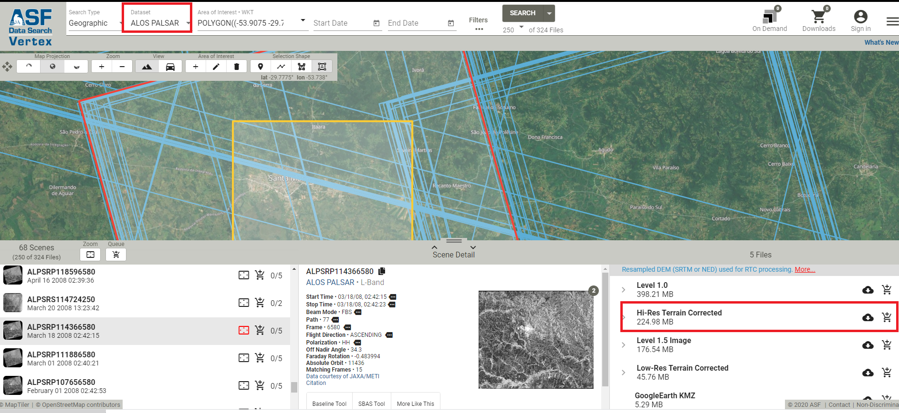
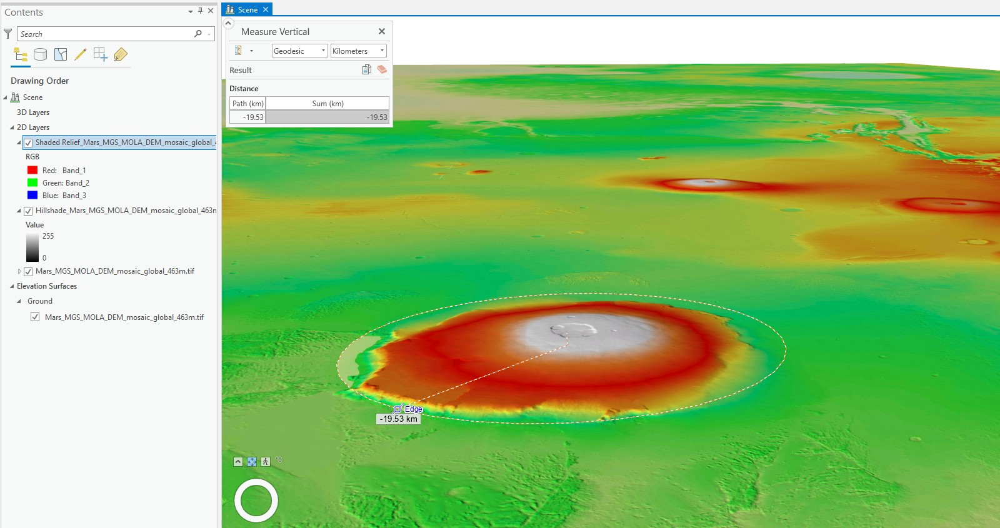

# Fotogrametria

## Satélites para aquisição/montagem de imagens estereoscópicas

- [ALOS PRISM](http://www.engesat.com.br/imagem-de-satelite/alos-prism/) O ALOS pode ser descrito como algo que se aproxima ALOS do satélite ideal, por oferecer imagens de alta ( PRISM de 2,50 m PAN)  e média (AVNIR-2 de 10 m colorido)  resolução e também imagens Radar. Com farto catalogo de imagens adquiridas, ele ainda é muito procurado e oferece dados de ótima qualidade radiométrica e geométrica.
- ASTER
- CATOSAT-1
- FORMOSAT-2
- GeoEye-1
- IKONOS
- KOMPSAT-2
- OrbView-3
- QuickBird
- RapidEye
- SPOT
- WorldView-1
- WorldView-2
- Zyiouan-3A

## As 3 principais fontes de Modelos Digitais de Elevação (MDE) grátis e globais
(crédito [forestgis](https://forest-gis.com/2020/12/as-3-principais-fontes-de-modelos-digitais-de-elevacao-mde-gratis-e-globais.html/) )

Não é preciso falar da importância dos modelos digitais de elevação e de terreno no mundo GIS atualmente. Muitos de nós precisamos destes dados diariamente para as mais diversas finalidades.
Vamos listar a seguir 3 fontes de dados de MDE gratuitos e globais:
### O SRTM
O SRTM ainda continua a ser um dos mais utilizados MDEs do mundo.
A NASA precisou de apenas 11 dias para capturar o modelo digital de elevação do planeta todo em 30 metros ainda em fevereiro do ano 2000.

No final de 2014, o governo dos Estados Unidos divulgou ao público a mais alta resolução disponível do DEM SRTM. Este modelo de elevação digital global de 1 arco segundo tem uma resolução espacial de cerca de 30 metros. Além disso, cobre a maior parte do mundo com uma precisão de altura vertical absoluta na casa de 16 m.

Onde Baixar? Via site da [USGS Earth Explorer](http://earthexplorer.usgs.gov/). Para baixar, seleciona sua área de interesse e na aba **Datasets**, selecione **Digital Elevation > SRTM > SRTM 1-ArcSecond Global**

### O ASTER
A operação conjunta da NASA e do ministério da encomia e indústria do Japão possibilitou o projeto **Advanced Spaceborne Thermal Emission and Reflection Radiometer** – **(ASTER)**. Como parte deste projeto surgiu o ASTER **Global Digital Elevation Model** **(GDEM)**.

#### ASTER GDEM v1 
Apesar de sua alta resolução e maior cobertura (80% da Terra), muitos usuários ficaram insatisfeitos com a qualidade e muitas áreas cobertas por nuvens não foram bem mapeadas.

#### ASTER GDEM v2
A versão 2 do GDEM se mostrou bem melhor com muitas correções de qualidade. O ASTER GDEM-versão 2 é considerado uma representação mais precisa do que o modelo de elevação do SRTM em terrenos mais montanhosos e acidentados.

#### ASTER GDEM v3 - ASTGTM
A versão 3 do GDEM ASTER, também chamada ASTGTM foi criado a partir do processamento automatizado de todo o arquivo ASTER Nível 1A de cenas adquirido entre 1 de março de 2000 e 30 de novembro de 2013. A correlação estéreo foi usada para produzir mais de um milhão de ASTER DEMs baseados em cenas individuais, ao qual o mascaramento de nuvem foi aplicado. Todos os DEMs filtrados em nuvem e DEMs não filtrados em nuvem foram empilhados. Valores ruins residuais e outliers foram removidos. Em áreas com empilhamento de dados limitado, vários DEMs de referência existentes foram usados para complementar os dados do ASTER para corrigir anomalias residuais. A média dos dados selecionados foi calculada para criar os valores finais dos pixels antes de particionar os dados em blocos de 1 ° por 1 ° com uma sobreposição de um pixel. Para corrigir os valores de elevação das superfícies dos corpos d’água, o produto de dados ASTER Global Water Bodies Database (ASTWBD) Versão 1 também foi gerado.

Onde Baixar? Na página [EarthData](https://search.earthdata.nasa.gov/search/granules?p=C1575726572-LPDAAC_ECS&pg%5B0%5D%5Bgsk%5D=-start_date&q=ASTGTM&m=-30.102644771829862!-55.22607421875!7!1!0!0%2C2&tl=1591894314!4!!) da NASA, definindo uma área de interesse no mapa e buscando por ASTGTM

### O ALOS PALSAR
São os dados de elevação em escala global mais precisos disponíveis (12.5m). Ele usa o Satélite Avançado de Observação Terrestre “DAICHI” (ALOS) baseado no mapeamento estéreo do PRISM. Onde você pode baixar? [Através do site ASF](https://search.asf.alaska.edu/#/?dataset=ALOS), selecionando a área de interesse. Para baixar você precisará logar ou criar uma conta gratuita no EarthData da NASA se ainda não tiver uma.

Ou ainda pode-se baixar os dados se [registrando online por meio do portal JAXA Global ALOS](http://www.eorc.jaxa.jp/ALOS/en/aw3d30/) e fazer o [download](https://www.eorc.jaxa.jp/ALOS/en/aw3d30/registration.htm) [WebMap Alos](https://www.eorc.jaxa.jp/ALOS/aw3d30/l_map_v2003.htm)

### LiDAR: The Earth Archive
Existe um projeto em andamento para mapear o planeta todo via LiDAR e disponibilizar gratuitamente. Ele é chamado de [*The Earth Archive*](https://www.theeartharchive.com/).
Os dados ainda não estão disponíveis mas a missão do projeto é:
>Escanear o planeta todo e construir um planeta virtual em LiDAR de código aberto >acessível a todos os cientistas para que possamos entender melhor o nosso mundo.
Enquanto este ainda não está disponível, confira algumas fontes de dados LiDAR gratuítas:
[OpenTopography: Dados LiDAR gratuitos de vários lugares do mundo](https://portal.opentopography.org/datasets)
[Outras 6 fontes](https://gisgeography.com/top-6-free-lidar-data-sources/)

### MOLA (Marte)
Nem só o planeta terra foi mapeado em 3D. Marte também já foi.

Com os dados do projeto MOLA (Mars Orbiter Laser Altimeter), você pode baixar o DEM de marte com resolução de 463 metros e descobrir suas feições. Lembre-se de utilizar a [projeção marciana como falamos aqui](http://forest-gis.com/2015/07/sistema-de-coordenadas-de-planetas-e-luas-do-sistema-solar.html/).
[https://planetarymaps.usgs.gov/mosaic/Mars_MGS_MOLA_DEM_mosaic_global_463m.tif](https://planetarymaps.usgs.gov/mosaic/Mars_MGS_MOLA_DEM_mosaic_global_463m.tif)

[https://astrogeology.usgs.gov/search/map/Mars/GlobalSurveyor/MOLA/Mars_MGS_MOLA_DEM_mosaic_global_463m](https://astrogeology.usgs.gov/search/map/Mars/GlobalSurveyor/MOLA/Mars_MGS_MOLA_DEM_mosaic_global_463m)
